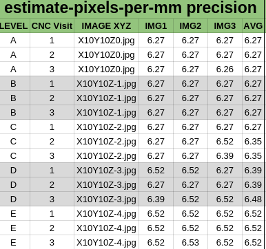

### FirePick Delta (FPD) Experiment XP001

### Q: How accurate is FPD vision-guided Z-movement? 
Many FPD applications require Z accuracy. For example, 3D printing requires
the extruder/bed separation to be a fraction of the extruded filament 
diameter. Since FPD has a camera, it should be possible to measure the
Z distance from the camera by detecting the change in image size of a 
known object. Closer images of a given object will appear larger than
farther images of the same object. 

### Hypothesis
Using only its camera, FirePick Delta is capable of detecting Z-position 
with repeatable accuracy of:

* **<2mm* using [hole detection](https://github.com/firepick1/FireSight/wiki/op-Points2Resolution)

### Considerations
**FPD steppers** are theoretically capable of moving the effector 300mm 
over about 3 complete revolutions using a 200*16 microsteps/revolution. 
This is a theoretical accuracy of:

	300mm/3revs/200steps/16microsteps = 0.03125mm/microstep

In practice, it is hard to move by a single microstep, although it is
possible to mimic such a small move by making two larger movements that 
differ by a small amount (e.g., +10-10.1 = 0.1).

**Camera Distortion** is a problem because the image resolution (pixels/mm) 
will change over the image. For example, perspective itself will cause 
the periphery of an image to be more compact than the center of the image
since the periphery of the image is further away from the center of the
camera lens. If we consistently use the same section of the image in our
measurements, we can mitigate this distortion.

**Object Measurement** is more accurate when we use multiple data points for
measurement. For example, taking the distance between the endpoints
of the imaged object is an obvious method, but it is also
inaccurate since there it relies entirely on the accuracy of the 
endpoint measurements themselves. However,
if we can use more points on the measured object to determine its size,
then our overall accuracy will improve.

### Method
1. Our measured object will be 8mm component tape, which has sprocket holes every 4mm
1. We will use `image` to take a series of 3 images at each point to determine vision accuracy
1. We will use five Z planes (A,B,C,D,E) spanning Z=0 to Z=-4mm
1. We will CNC reposition the camera at each point three times to determine movement accuracy
1. After each set of point measurements, we will return to a known position (arbitrarily Z=-10)
1. We will use `process-holes` to measure the object size using [Simon's FireSight pipeline](https://github.com/firepick1/FireSight/wiki/op-Points2Resolution)

### Results

Using
[Raw results](process-holes.out)

