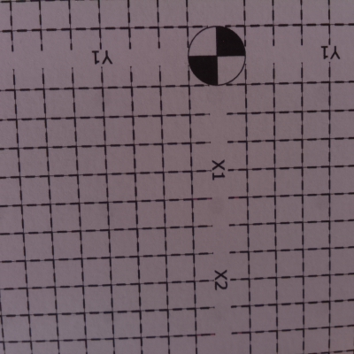
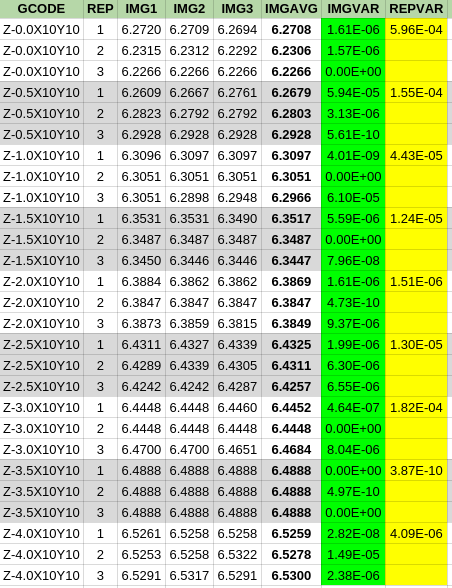

### FirePick Delta (FPD) Experiment XP002

### Q: How accurate is FPD vision-guided Z-movement? 
Many FPD applications require Z accuracy. For example, 3D printing requires
the extruder/bed separation to be a fraction of the extruded filament 
diameter. Since FPD has a camera, it should be possible to measure the
Z distance from the camera by detecting the change in image size of a 
known object. Closer images of a given object will appear larger than
farther images of the same object. 

Previous related experiments:

* [XP001-resolution](../XP001-resolution)

### Hypothesis
Using only its camera, FirePick Delta is capable of detecting Z-position 
with repeatable accuracy of:

* **<1mm** using [grid detection](https://github.com/firepick1/FireSight/wiki/op-matchGrid)

### Considerations
See [XP001-resolution](../XP001-resolution)

**Maximize feature separation**. The accuracy of Z-distance calculation is very much influenced
by the size of the measured object. Changes in perpective are scaled with the size of the object.
Larger objects provide more accuracy. A 5mm grid lets us treat three grid vertices in a row
as a single 15mm object, which is about 4x larger than the 4mm hole separation measured in 
[XP001-resolution](../XP001-resolution).

**Maximize recognized features**. Measuring more objects provides greater accuracy.
By using a full grid that covers the image, we can easily get more data than measuring
a single row of holes as in 
[XP001-resolution](../XP001-resolution).

### Method
1. Our measured object will be the standard FirePick 5mm calibration grid.
1. We will use `image` to take a series of 3 images at each point to determine vision accuracy
1. We will use nine Z planes (A,B,C,D,E) spanning Z=0 to Z=-4mm in 0.5mm increments
1. We will CNC reposition the camera at each point three times to determine movement accuracy
1. After each set of point measurements, we will return to a known position (arbitrarily Z=-10)
1. We will use `process-grid` to measure the object size using [matchGrid](https://github.com/firepick1/FireSight/wiki/op-matchGrid), which was developed for FireSight camera calibration.

### Results
Using the [images](img) created by `image`, the `process-grid` script 
generated [raw data](process-grid.out) summarized in the table below:

Of interest are the two far right columns of the table:

* **IMGVAR** shows the image variance over three images taken without repositioning the head
* **REPVAR** shows the positioning variance over three separate "random access" movements to a particular Z-position.

The image variance is remarkably, 10-100x smaller than the positioning variance, which suggests that
the camera is quite accurate in measuring Z-distance and that the differences in IMGAVG 
are mostly due to positioning.
The results indicate that the FirePick Delta camera can indeed be used to coordinate movement 
with a Z-accuracy of 0.5mm or better. Indeed, it would appear that optical bed levelling is 
quite feasible using a calibration grid as the camera objective.
