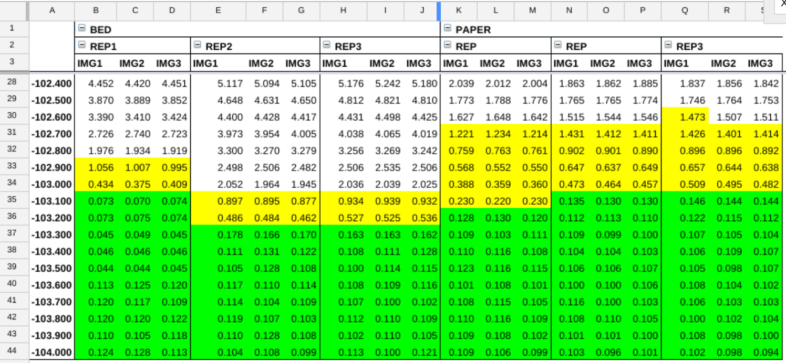
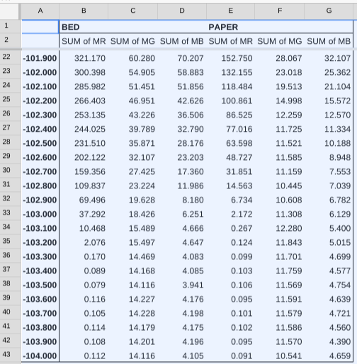

### Experiment XP004 Camera as Z Probe

### Q: Can FirePick Delta detect the thickness of a piece of paper?

A piece of paper is <0.1mm thick. 

We will use a camera mounted on the effector as a Z-probe. Specifically,
we'll use a Raspberry Pi Noir camera mounted in the center of the 
FPD effector. An attached shade will protect the camera from physical
contact and will darken the field of view as it gets close to the FPD bed.
Our hope is that measurements taken with and without a piece of paper on
the bed will reveal the thickness of the piece of paper.

### Hypothesis
An effector-mounted downward looking camera can be used as a Z-probe

### Considerations

**Use RGB channels separately.**
The Noir camera is more sensitive to lower frequency light (e.g. red). 
Process each channel separately to detect darkness.

**The Raspberry Pi camera has a red LED.**
Although normally annoying, the red LED can actually help. As the camera
approaches the bed, the LED illuminates the field, yielding a brighter red channel.
When the shade meets the bed, that brighter light is cut off. The red LED therefore
provides greater contrast and resolution.

**Home before each measurement.**
For consistency, each measurement is preceded by G28 G0Z0M400 to ensure that the
effector starts at a known position. This is time-consuming, but eliminates uncertainty 
from the procedure.

**Take lots of samples.**
The FPD is accurate, but not reproduceably accurate to 0.1mm. However, multiple samples
provide more information and therefore greater accuracy. We will take 41x3x3 samples for
each use case (bed, bed+paper), for a total of 720 images.

### Method
1. We will probe at X0Y0 to various Z-depths, in increments of 0.1mm offset from X0Y0Z0
1. At each Z-depth, we will take three images (IMG1, IMG2, IMG3)
1. We will repeat the probing of Z-depths three times (REP1, REP2, REP3)
1. We will use [FireSight meanStdDev](https://github.com/firepick1/FireSight/wiki/op-meanStdDev) to determine the mean and standard deviation of each RGB channel in a sampled image.

### Results

**FPD can detect a piece of paper using a camera as Z-probe.**
Using the [bed-only images](img-bed) and [bed-with-paper images](img-paper) created by `image`, 
the `process` script generated [raw data](meanstddev.out) summarized in the table below for the red channel:
Notice that BED-REP1 detects a Z-depth 0.2 higher than BED-REP2 or BED-REP3. 
This difference is attributable to FPD movement error, which is about +/-0.1mm.

**The red channel is much more sensitive than blue or green.**
The mean RGB values are called out as (MR,MG,MB) in the table:

### Conclusion
It is possible to use an FPD effector camera as a Zprobe, taking images at intervals of 0.1mm,
using more images and repetitions for higher accuracy.

