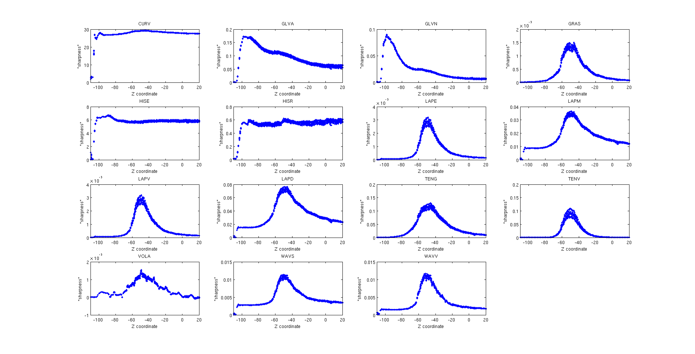
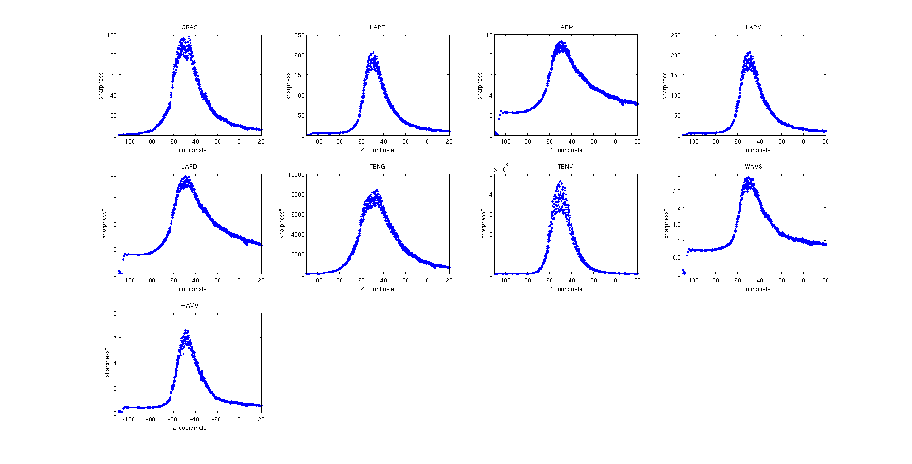

### Experiment XP005 Focal Range Determination

### Q: What's the best way to automatically determine the focal range of a fixed focus camera?

FirePick Delta currently relies on fixed focus camera, which are affordable and ubiquitous.
For a consistent user experience, we need a way to calibrate the fixed focus so that
we can tell the operator how to adjust the focus to a recommended norm.

### Hypothesis
A series of images taken along the Z-axis at X0Y0 provides information sufficient to 
determine the focal range in real world coordinates (vs. raw machine coordinates)

### Considerations

**Raw machine coordinates** are uncorrected machine coordinates. There is no guarantee
that a 1mm move in raw machine coordinates will actually move the effector 1mm or even
move the effector in the desired direction. 

**Measure at X0Y0** to reduce raw machine coordinate error. Moves along X0Y0 require identical
delta motor translations at each step.

**Use the calibration grid** to correlate actual Z-height with raw Z-height.

**Home before each measurement.**
For consistency, each measurement is preceded by G28 G0Z0M400 to ensure that the
effector starts at a known position. This is time-consuming, but eliminates uncertainty 
from the procedure.

**Take lots of samples.**
The FPD is accurate, but not reproduceably accurate to 0.1mm. However, multiple samples
provide more information and therefore greater accuracy. We will take 3 images at each
Z coordinate and repeat the entire process 3 times.

### Method
<a href="https://www.youtube.com/watch?v=ZUBUSP92gG8">Video</a>

1. We will probe at X0Y0 to various Z-depths, in increments of 1mm from Z30 to Z-110
1. At each Z-depth, we will take three images (IMG1, IMG2, IMG3)
1. We will repeat the probing of Z-depths three times (REP1, REP2, REP3)
1. Simon will figure out something to determine the focal range

### Results

TBD

# Experiments to determine a 'sharpness' of an image using various methods.
The input is the series of images as described above.
A MATLAB <a href="http://www.mathworks.com/matlabcentral/fileexchange/27314-focus-measure">script</a> is used to compare several methods for measuring relative degree of focus of an image.
The output of some of the methods is shown in the following image. The x axis shows z coordinate of the end effector, y axis shows 'sharpness', which is normalized to span the [0,1] interval for each method separately (based on the input data).

The methods mostly agree, that the camera was focused to about 50 mm.
Selecting such methods, which have reasonable processing time (in MATLAB on an Intel i5 laptop) and which show a peak around z=50mm, we get the following methods: 'GRAS', 'LAPE', 'LAPM', 'LAPV', 'LAPD', 'TENG', 'TENV', 'WAVS', and 'WAVV'.

The mean processing time per 400x400px input image on a Intel i5 laptop is show in the following table.

<table>
<tr><td>GRAS</td><td>0.0080 s</td></tr>
<tr><td>LAPE</td><td>0.0374 s</td></tr>
<tr><td>LAPM</td><td>0.0411 s</td></tr>
<tr><td>LAPV</td><td>0.0412 s</td></tr>
<tr><td>LAPD</td><td>0.0824 s</td></tr>
<tr><td>TENG</td><td>0.0550 s</td></tr>
<tr><td>TENV</td><td>0.0620 s</td></tr>
<tr><td>WAVS</td><td>0.1776 s</td></tr>
<tr><td>WAVV</td><td>0.2062 s</td></tr>
</table>

## Methods
### GRAS - Absolute squared gradient
A.M. Eskicioglu and P. S. Fisher. Image quality measures and their performance.
Communications, IEEE Transactions on, 43(12):2959–2965, 1995

F = \dfrac{1}{nx \cdot ny} \sum_x \sum_y | I_{x,y} - I_{x+1,y} | ^2

### LAPE - Energy of laplacian [Subbarao92a]

### LAPM -  Modified Laplacian [Nayar89]

### LAPV - Variance of laplacian (Pech2000)

### LAPD - Diagonal laplacian (Thelen2009)

### TENG - Tenengrad (Krotkov86)

### TENV - Tenengrad variance (Pech2000)

### WAVS - Sum of Wavelet coeffs (Yang2003)

### WAVV - Variance of  Wav...(Yang2003)

